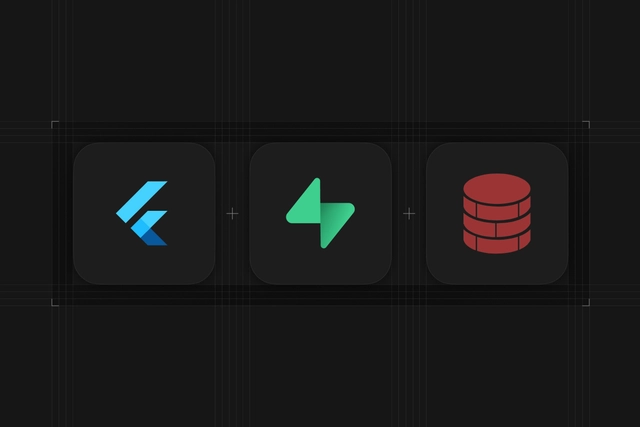

# Habitly

  

## 🌱 About Habitly

**Habitly** is a powerful and flexible habit tracker designed to help you build and maintain positive routines with ease. Whether you're working on daily wellness, productivity, fitness, or mindfulness goals, Habitly provides the tools you need to stay consistent and motivated.

### ✨ Key Features

- 🗓️ **Custom Habit Creation** – Set habits with flexible schedules.
- 🔔 **Smart Reminders** – Never forget a task with intelligent notifications.
- 📊 **Detailed Analytics** – Track your progress with insightful charts and streaks.
- 📶 **Offline-First** – Use it anywhere, anytime – even without an internet connection.
- ☁️ **Cloud Sync** – Keep your data backed up and accessible across devices.
- 🎯 **Goal Setting & Motivation** – Earn rewards and track milestones.
- 🛠️ **Modern UI with Flutter** – Clean, responsive interface made with Flutter.

---

Start building better habits today with **Habitly**!
